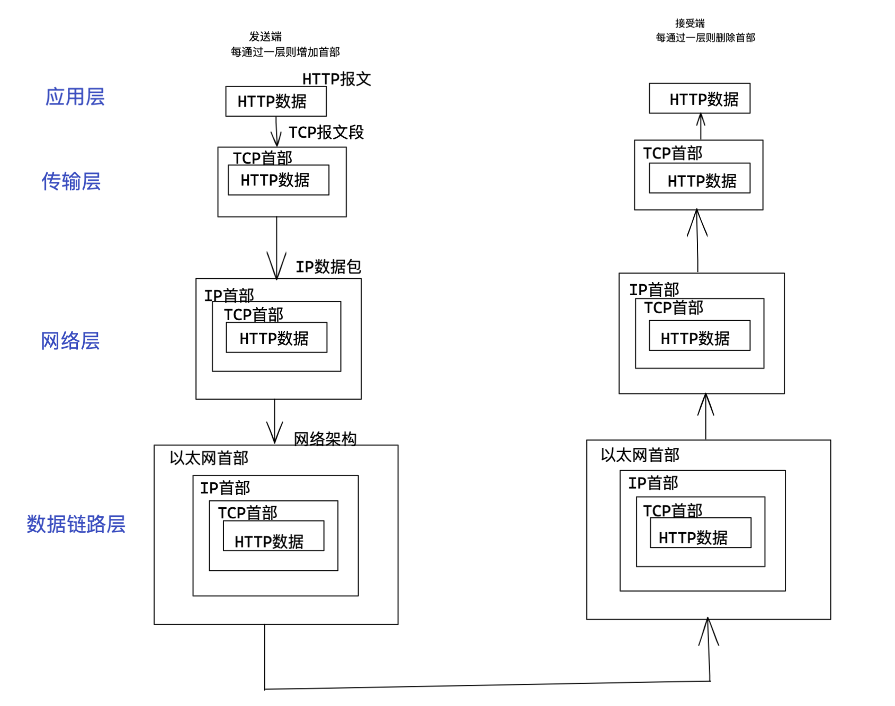

## 1、了解Web及网络基础

### 1、 网络基础TCP/IP

通常使用的网络（包括互联网）是在TCP/IP协议族的基础上运作的。而HTTP属于它内部的一个子集

#### 1.1、TCP/IP协议族

不同的硬件、操作系统之间的通信，所有的这一切都需要一种规则。而我们就把这种规则称为协议（protocol）

**==TCP/IP是网络相关的各类协议族的总称==**

协议中存在各式各样的内容。从电缆的规格和IP地址的选定方法、寻找异地用户的方法、双方建立通信的顺序、以及web页面显示需要处理的步骤，等等。

#### 1.2、TCP/IP的分层管理

TCP/IP协议族里重要的一点就是分层。TCP/IP协议族按层次分别分为以下4层：应用层、传输层、网络层、数据链路层

把TCP/IP分层是为了更方便的维护，当某个地方需要改变设计时，只需要把变动的层次替换掉即可，不需要把所有整体替换掉。把各层之间的接口部分规划好之后，每个层次内部的设计就能够自由改动了

#### 1.3、TCP/IP协议族各层的作用如下

##### 1.3.1、应用层

应用层决定了向用户提供应用服务时通信的活动

TCP/IP协议族内预存了各类通用的应用服务。比如，FTP（File Transfer Protocol，文件传输协议）和DNS（Doamin Name System，域名系统）服务就是其中两类。==HTTP协议也处于该层==

##### 1.3.2、传输层

传输层对上层应用层，提供处于网络连接中的两台计算机之间的数据传输

在传输层有两个性质不同的协议：TCP（Transmisson Control Protocol，传输控制协议）和 UDP（User Data Protocol，用户数据报协议）

##### 1.3.3、网络层（又名网络互连层）

网络层用来处理在网络上流动的数据包。数据包时候网络传输的最小数据单位。该层规定了通过怎样的路径（所谓的传输路线）到达对方计算机，并把数据包传送给对方。

与对方计算机之间通过多台计算机或网络设备进行传输时，网络层所起的作用就是在众多的的选项内选择一条传输路线

##### 1.3.4、数据链路层（又名数据联络层，网络接口层）

用来处理连接网络的硬件部分。包括控制操作系统、硬件的设备驱动、NIC（Newwork Interface Card，网络适配器，即网卡），及光纤等物理可见部分（还包括连接器等一切传输媒介）。硬件上的范畴均在链路层的作用范围之内

#### 1.4、TCP/IP通信传输

利用TCP/IP协议族进行网络通信时，会通过分层顺序与对方进行通信。发送端从应用层往下走，接受端则从链路层往上走。

用HTTP举例，首先作为发送端端客户端在应用层（HTTP协议）发出一个想看Web页面的HTTP请求。

接着，为了传输方便，在传输层（TCP协议）把从应用层收到的数据（HTTP请求报文）进行分割，并在各个报文上打上标记序号及端口号转发给网络层。

在网络层（IP协议）增加作为通信目的地的MAC地址后转发给链路层。这样一来，发往网络通信请求就准备齐全了

接受端的服务器在链路层接收到数据，按序往上层发送，一直到应用层，才算真正接受到由客户端发送过来的HTTP请求

发送端在层与层之间传输数据时，每经过一层时必定会被打上一个该层时一个该层所属的首部信息。反之，接受端在层与层传输数据时，每经过一层时会把对应的首部消去。

==这种把数据信息包装起来的做法称为封装（encapsulate）==

#### 1.5、与HTTP关系密切的协议：IP、TCP和DNS

针对在TCP/IP协议族中与HTTP密不可分的3个协议（IP、TCP和DNS）进行说明

##### 1.5.1、负责传输的IP协议

按层次分，IP（Internet Protocol）网络协议位于网络层，几乎所有使用网络的系统都会用到IP协议。TCP/IP协议族中的IP指的就是网络协议，协议名称中占据了一半位置。不要把IP和IP地址搞混，“IP”其实是一种协议的名称

IP协议的作用就是把各种数据包传送给对方。而要保证确实传送到对方那里，则需要满足各类条件。其中两个重要的条件是IP地址和MAC地址（Media Access Control Address）

IP地址指明了节点被分配到的地址，MAC地址是指网卡所属的固定地址。IP地址可以和MAC地址进行配对。IP地址可变换，但MAC地址基本上不会更改。

**使用ARP协议凭借MAC地址进行通信**

IP间的通信依赖MAC地址。在网络上，通信的双方在同一局域网（LAN）内的情况是很少的，通常是经过多台计算机和网址设备中转才能连接到对方。而在进行中转时，会利用下一站中转设备的MAC地址来搜索下一个目标地址。这时，会采用ARP协议（Address Resolution Protocol）。ARP是一种用以解析地址的协议，根据通信的IP地址就可以反查出对应的MAC地址

##### 1.5.2、确保可靠性的TCP协议

按层次分，TCP位于传输层，提供可靠的字节流服务。

所谓的字节流服务（Byte Stream Service）是指，为了方便传输，将大块数据分割成报文段（segment）为单位的数据包进行管理。而可靠的传输服务是指，能够数据准确可靠地传给对方。一言以蔽之，TCP协议为了更容易传送大数据才把数据分割，而且TCP协议能够确认数据最终是否送达到对方。

**==确保数据能到目标==**

为了准确无误地将数据传达目标处，TCP协议采用了三次握手（three-way handshaking）策略。用TCP协议把数据包送出去后，TCP不会对传送后的情况置之不理，它一定会向对方确认是否成功送达。握手过程中使用了TCP的标志（flag）—— SYN（synchronize）和ACK（acknowledgement）

发送端首先发送一个带SYN标志的数据包给对方。接受端收到后，回传一个带有SYN/ACK标志的数据包以示传达确认信息。最好，发送端再回传一个带ACK标志的数据包，代表“握手”结束

若在握手过程中某个阶段莫名中断，TCP协议会再次以相同的顺序发送相同的数据包

除了上次三次握手，TCP协议还有其他各种手段来保证通信的可靠性

##### 1.5.3、负责域名解析的DNS服务

DNS（Domain Name System）服务是和HTTP协议一样位于应用层的协议。它提供域名到IP地址之间的解析服务。

DNS协议提供通过域名查找IP地址，或逆向从IP地址反查域名的服务

##### 1.5.4 

