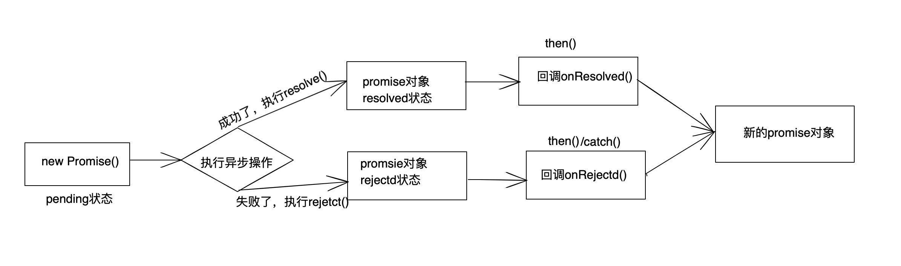

# Promise

## Promise是什么？

### 知识预习

Js是单线程的 ，但是一些高耗时操作就带来了进程堵塞问题。为了解决这个问题，Js有两种任务的执行模式：

**同步模式（Synchronous）和 异步模式（Asynchronous）**

在异步模式下，创建异步任务主要分为宏任务与微任务两种。在ES6规范中，宏任务（Macrotask）称为Task。微任务（Microtask）称为Jobs。宏任务是由宿主（浏览器、Node)发起的，而微任务由JS自身发起

### 宏任务与微任务的几种创建方式

| 宏任务（Macrotask） | 微任务（Microtask） |
| :-----------------: | :-----------------: |
|                     |                     |
|                     |                     |
|                     |                     |
|                     |                     |
|                     |                     |
|                     |                     |


### Promise的基本原理：

- Promise是一个类，在执行这个类的时候会传入一个执行器，这个执行器会立即执行
- Promise会有三种状态：
  - Pending 等待
  - Fulfilled 完成
  - Rejected 失败
- 状态只能由Pending ——>Fulfilledh或者Pending ——>Rejected，且一但发生改变便不可二次修改
- Promise中使用 resolve 和 reject 两个函数来更改状态
- then 方法内部做但事情就是状态判断
  - 如果状态是成功，调用成功回调函数
  - 如果状态是失败，调用失败回调函数

### 1、抽象表达：

- Promise是一门新的技术（ES6规范）
- Promise是JS中进行异步编程的==新解决方案==
  - 备注：旧方案是单纯使用回调函数

### 2、具体表达：

- 从语法上来说：Promise是一个构造函数
- 从功能上来说：Promise对象是用来封装一个异步操作并可以获取其成功/失败的结果值

**<font color='red'>异步编程： fs文件操作、数据库操作、ajax、定时器。。。</font>**

## 为什么要用Promise？

### 1、指定回调函数的方式更加灵活

旧的：必须在启动异步任务前指定

promise：启动异步任务 => 返回promise对象 => 给promsie对象绑定回调函数（甚至可以在异步任务结束后指定/多个）

### 2、支持链式调用，可以解决回调地狱问题

什么是回调地狱？

回调函数嵌套调用，外部回调函数异步执行的结果是嵌套的回调执行的条件

回调地狱的缺点？

不利于阅读，不利于异常处理

解决方案：

### 3、Promise的状态

实例对象中的一个属性 [PromiseState]

pending 未决定的

resolved / fulfilled 成功

reject 失败

### 4、promise 对象的值

实例对象中的另一个属性 [PromiseResult]

保存着对象[成功/失败]的结果

- pending 变为 resolved

- pending 变为 rejected

  说明：只有这2种，且一个promise对象只能改变一次

  无论变为成功还是失败，都会有一个结果数据

  成功的结果数据一般称为value，失败的结果数据一般称为reason

  

### 5、promise的基本流程



##  使用Promise

### 1、Promise构造函数：

**Promise(exator(){})**

- executor函数：执行器	(resolve,reject) => {}
- resolve函数：内部定义成功时我们调用的函数 value => {}
- reject函数：内部定义失败时我们调用的函数 reason => {}

**<font color='red'>executor会在Promise内部立即同步调用，异步操作在执行器中执行</font>**

### 2、Promise.prototype.then方法：

**（onResolved,onRejected）=> {}**

- onResolve函数：成功的回调函数（value) => {}
- onRejectd函数：失败的回调函数（reason) => {}

说明：指定用于得到成功value的成功回调和用于得到失败reason的失败回调返回一个新的promsie对象

### 3、Promise.prototype.catch方法：

**（onRejected）=> {}**

- onRejected函数：失败的回调函数（reason） => {}

### 4、Promise.resolve方法：

**(onResolve) => {}**

```javascript
//如果传入的参数为 非Promsie类型的对象，则返回的结果为成功promise对象
const p = Promise.resolve(123)
console.log(p);//Promise{123}
//如果传入的参数为Promise对象，则参数的结果决定了 resolve 结果
const p1 = Promise.resolve(new Promise((resolve, reject) => {
  reject('Error')
}))
p1.catch(reason => {
  console.log(reason);//Error
})
console.log(p1);//Promise { <rejected> 'Error' }
```

### 5、Promise.reject 方法：

**(onRace) => {}**

reason：失败的原因

说明：返回一个失败的promise对象

### 6、Promise.all方法：

**(promise) => {}**

promises:包含 n 个promise 的数组

说明：返回一个新的promise，只有所有的promise都成功才成功，只要有一个失败了就直接失败

全都成功的结果：

```js
    const p1 = new Promise((resolve,reject) => {
      resolve('ok')
    })
    const p2 = new Promise((resolve,reject) => {
      resolve('ok')
    })
    const p3 = new Promise((resolve,reject) => {
      resolve('ok')
    })
    const res = Promise.all([p1,p2,p3])
    console.log(res);
    /* 
      Promise {<pending>}
      [[Prototype]]: Promise
      [[PromiseState]]: "fulfilled"
      [[PromiseResult]]: Array(3)
      0: "ok"
      1: "ok"
      2: "ok"
      length: 3
      [[Prototype]]: Array(0)
    */
```

有失败的结果：

```js
const p1 = new Promise((resolve,reject) => {
  resolve('ok')
})
const p2 = new Promise((resolve,reject) => {
  reject('err')
})
const p3 = new Promise((resolve,reject) => {
  resolve('ok')
})
const res = Promise.all([p1,p2,p3])
console.log(res);
/* 
  Promise {<pending>}
  [[Prototype]]: Promise
  [[PromiseState]]: "rejected"
  [[PromiseResult]]: "err"
*/
```

### 7、Promise.race方法：

**(promises) => {}**

promises：包含 n 个promise的数组

说明：返回一个新的promise，第一个完成的promise的结果状态就是最终的结果状态

使用场景：ajax请求和超时回调，ajax在超时回调执行前完成，显示回调结果，否则显示请求超时

```js
const p1 = new Promise((resolve,reject) => {
  resolve('ok')
})
const p2 = new Promise((resolve,reject) => {
  reject('err')
})
const p3 = new Promise((resolve,reject) => {
  resolve('ok')
})
const res = Promise.race([p1,p2,p3])
console.log(res);
```

## Promise的几个关键问题

### 3、异常穿透

### 7、中断 Promise 链

## Promise代码封装

### 1、构造函数封装

```js
// 声明构造函数
function Promise(executor) {
  // 添加属性
  this.PromiseState = 'pending'
  this.PromiseResult = null
  this.callbacks = []
  // 保存实例对象的 this 值
  const self = this
  // resolve 函数
  function resolve(data) {
    // 保证状态只能被修改一次
    if (self.PromiseState !== 'pending') return;
    // 1、修改对象的状态 (promiseState)
    self.PromiseState = 'fulfilled'
    // 2、设置对象结果值 (promiseResult)
    self.PromiseResult = data
    // 调用成功的回调函数
    setTimeout(_ => {
      self.callbacks.forEach(item => {
        item.onResolved(data)
      })
    })
  }
  // reject 函数
  function reject(data) {
    // 保证状态只能被修改一次
    if (self.PromiseState !== 'pending') return;
    // 1、修改对象的状态 (promiseState)
    self.PromiseState = 'rejected'
    // 2、设置对象结果值 (promiseResult)
    self.PromiseResult = data
    // 调用失败的回调函数
    setTimeout(_ => {
      self.callbacks.forEach(item => {
        item.onReject(data)
      })
    })
  }
  try {
    //同步调用 【执行器函数】
    executor(resolve, reject)
  } catch (e) {
    reject(e) 
  }
}
// 添加 then 的方法
Promise.prototype.then = function(onResolved, onReject) {
  const self = this
  //判断回调函数参数
  if (typeof onReject !== 'function') {
    onReject = reason => {
      throw reason
    }
  }
  if (typeof onResolved !== 'function') {
    onResolved = value => value
  }
  return new Promise((resolve, reject) => {
    //封装函数
    function callback(type) {
      try {
        const result = type(self.PromiseResult)
        //判断
        if (result instanceof Promise) {//如果是 Promise 类型的对象
          result.then(v => {resolve(v)},r => {reject(r)})
        } else {
          resolve(result)//结果的对象 状态为【成功】
        }
      }catch(e) {
        reject(e)
      }
    }
    //调用回调函数 PromiseState
    if (this.PromiseState === 'fulfilled') {
      setTimeout(_ => {
        callback(onResolved)
      })
    }
    if (this.PromiseState === 'rejected') {
      setTimeout(_ => {
        callback(onReject)
      })
    }
    // 判断 pending 状态
    if (this.PromiseState === 'pending') {
      //保存回调函数
      this.callbacks.push({
        onResolved: function() {
          callback(onResolved)
        },
        onReject: function() {
          callback(onReject)
        }
      })
    }
  })
}
//  添加 catch 方法 
Promise.prototype.catch = function(onReject) {
  return this.then(undefined,onReject)
}
//添加 resolve 方法
Promise.resolve = function(value) {
  //返回 promsie 对象
  return new Promise((resolve, reject) => {
    // 判断是不是 promise 对象
    if(value instanceof Promise) {
      value.then( v=> {resolve(v)},r => {reject(r)})
    } else {
      // 状态设置为成功
      resolve(value)
    }
  })
}
// 添加 reject 方法
Promise.reject = function(reason) {
  return new Promise((resolve, reject) => {
    reject(reason)
  })
}
//添加 all 方法
Promise.all = function(promises) {
  //返回结果为 promise 对象
  return new Promise((resolve, reject) => {
    //声明变量
    let count = 0
    let arr = []
    //遍历
    for (let i = 0; i < promises.length; i++) {
      promises[i].then(v => {
        // 得知对象的状态是成功的
        //每个promise对象 都是成功的
        count++
        // 将当前 promise 对象成功的结果 存入到数组中
        arr[i] = v
        if (count === promises.length) {
          resolve(arr)//修改状态
        }
      }, r => {
        reject(r)
      })
    }
  })
}
// 添加 race 方法
Promise.race = function(promises) {
  return new Promise((resolve, rejetc) => {
    for (let i = 0; i < promises.length; i++) {
      promises[i].then(v => {
        // 修改返回对象的状态为 [成功]
        resolve(v)
      }, r => {
        // 修改返回对象的状态为 [失败]
        rejetc(r)
      })
    }
  })
}
```

### 2、class封装

```js
class Promise {
  // 构造方法
  constructor(executor) {
    // 添加属性
    this.PromiseState = 'pending'
    this.PromiseResult = null
    this.callbacks = []
    // 保存实例对象的 this 值
    const self = this
    // resolve 函数
    function resolve(data) {
      // 保证状态只能被修改一次
      if (self.PromiseState !== 'pending') return;
      // 1、修改对象的状态 (promiseState)
      self.PromiseState = 'fulfilled'
      // 2、设置对象结果值 (promiseResult)
      self.PromiseResult = data
      // 调用成功的回调函数
      setTimeout(_ => {
        self.callbacks.forEach(item => {
          item.onResolved(data)
        })
      })
    }
    // reject 函数
    function reject(data) {
      // 保证状态只能被修改一次
      if (self.PromiseState !== 'pending') return;
      // 1、修改对象的状态 (promiseState)
      self.PromiseState = 'rejected'
      // 2、设置对象结果值 (promiseResult)
      self.PromiseResult = data
      // 调用失败的回调函数
      setTimeout(_ => {
        self.callbacks.forEach(item => {
          item.onReject(data)
        })
      })
    }
    try {
      //同步调用 【执行器函数】
      executor(resolve, reject)
    } catch (e) {
      reject(e) 
    }
  }
  // then方法
  then(onResolved, onReject) {
    const self = this
    //判断回调函数参数
    if (typeof onReject !== 'function') {
      onReject = reason => {
        throw reason
      }
    }
    if (typeof onResolved !== 'function') {
      onResolved = value => value
    }
    return new Promise((resolve, reject) => {
      //封装函数
      function callback(methodType) {
        try {
          const result = methodType(self.PromiseResult)
          //判断
          if (result instanceof Promise) {//如果是 Promise 类型的对象
            result.then(v => {resolve(v)},r => {reject(r)})
          } else {
            resolve(result)//结果的对象 状态为【成功】
          }
        }catch(e) {
          reject(e)
        }
      }
      //调用回调函数 PromiseState
      if (this.PromiseState === 'fulfilled') {
        setTimeout(_ => {
          callback(onResolved)
        })
      }
      if (this.PromiseState === 'rejected') {
        setTimeout(_ => {
          callback(onReject)
        })
      }
      // 判断 pending 状态
      if (this.PromiseState === 'pending') {
        //保存回调函数
        this.callbacks.push({
          onResolved: function() {
            callback(onResolved)
          },
          onReject: function() {
            callback(onReject)
          }
        })
      }
    })
  }
  // catch方法
  catch(onReject) {
    return this.then(undefined,onReject)
  }
  // resolve 方法
  static resolve(value) {
    //返回 promsie 对象
    return new Promise((resolve, reject) => {
      // 判断是不是 promise 对象
      if(value instanceof Promise) {
        value.then( v=> {resolve(v)},r => {reject(r)})
      } else {
        // 状态设置为成功
        resolve(value)
      }
    })
  }
  // reject 方法
  static reject(reason) {
    return new Promise((resolve, reject) => {
      reject(reason)
    })
  }
  // all方法
  static all(promises) {
    //返回结果为 promise 对象
    return new Promise((resolve, reject) => {
      //声明变量
      let count = 0
      let arr = []
      //遍历
      for (let i = 0; i < promises.length; i++) {
        promises[i].then(v => {
          // 得知对象的状态是成功的
          //每个promise对象 都是成功的
          count++
          // 将当前 promise 对象成功的结果 存入到数组中
          arr[i] = v
          if (count === promises.length) {
            resolve(arr)//修改状态
          }
        }, r => {
          reject(r)
        })
      }
    }) 
  }
  // race方法
  static race(promises) {
    return new Promise((resolve, rejetc) => {
      for (let i = 0; i < promises.length; i++) {
        promises[i].then(v => {
          // 修改返回对象的状态为 [成功]
          resolve(v)
        }, r => {
          // 修改返回对象的状态为 [失败]
          rejetc(r)
        })
      }
    })
  }
}
```

## async 与 await

### 1、async 函数

==**函数的返回值 为promise对象**==

```js
async function main() {
  //1、如果返回值是一个非Promise类型的数据
  return 123
  //2、如果返回的是一个Promise对象
  return new Promise((resolve,reject) => {
    resolve('ok')
  })
  //3、抛出异常
  throw 'oh～no'
}
const res = main()
console.log(res)
```

==**promise 对象的结果由async函数执行的返回值决定**==

### 2、await 表达式

==**await右侧的表达式一般为promise对象，但也可以是其他的值**==

==**如果表达式是promsie对象，await返回的是promise成功的值**==

==**如果表达式是其他值，直接将此值作为await的返回值**==

```js
async function main () {
  const p = new Promise((resolve,reject) => {
    // resolve('ok啦')
    reject('不ok啦')
  }) 
  //1、右侧为 promise 的对象
  // let res = await p
  // console.log(res);//ok啦
  //2、右侧为其他类型的数据
  // let res1= await 123
  // console.log(res1);//123
  //3、如果promise的是失败的状态
  try{
    let res3 = await p
    console.log(res3);
  }catch(e) {
    console.log(e);//不ok啦
    // console.log(res3);//ReferenceError: res3 is not defined
  }
}
main()
```

### 3、注意：

==**await必须写在async函数中，但async函数中可以没有await**==

==**如果await的promise失败了，就会抛出异常，需要通过try ...catch捕获异常**==